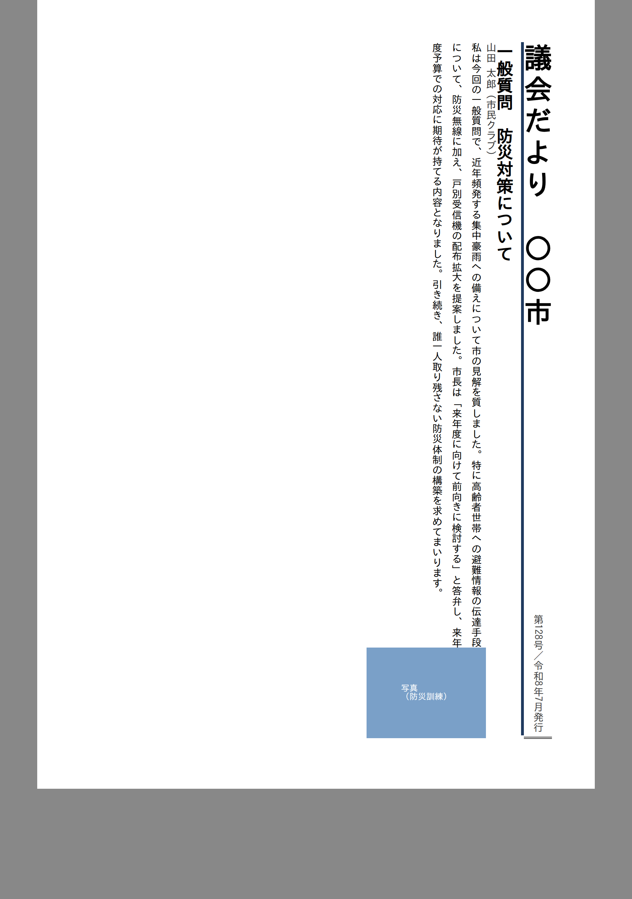
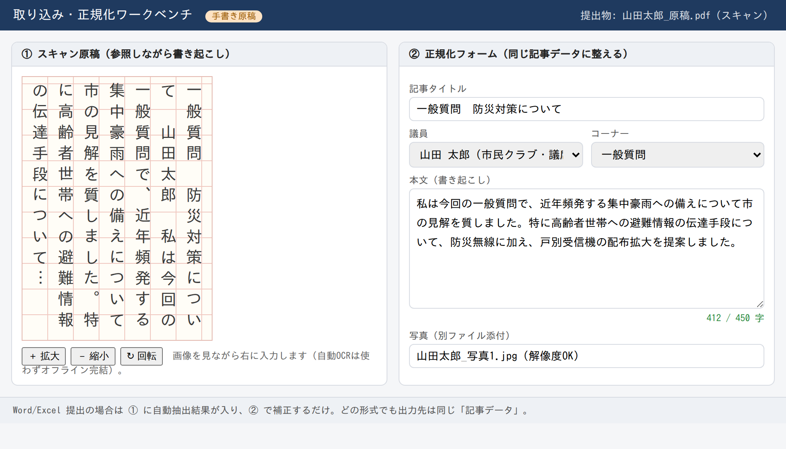

# P0（PoC）結果レポート

> 対象: 設計・仕様書 §10「P0 PoC（要素検証）」
> 実施日: 2026-06-30
> 結論: **主要な技術リスクはクリア。実装フェーズ（P1〜）へ進める見込み。**

---

## 1. 検証の目的

実装着手前に、技術的に一番不確実だった以下を「実際に動くコード」で検証した。

| # | 検証項目 | 紐づくリスク |
| --- | --- | --- |
| V-1 | **縦書きの議会だより紙面を .docx で出力**できるか | R-1 / R-2 |
| V-2 | 縦書き紙面の**プレビュー表示と PDF 出力**が成立するか | R-1 / R-2 |
| V-3 | 提出 Word(.docx) を**取り込んで項目（タイトル/氏名/本文）に判別**できるか | R-3 / R-5 |
| V-4 | **取り込み・正規化ワークベンチ**（手書き書き起こし）の操作感 | R-3b |

検証コードは `poc/` 一式。再現手順は §6 を参照。

---

## 2. V-1: 縦書き .docx 出力 ✅

`docx` ライブラリ（v9）でセクションの文字方向を縦書きに設定して出力した。

- 設定箇所: セクションの `page.textDirection = PageTextDirectionType.TOP_TO_BOTTOM_RIGHT_TO_LEFT`
- 生成した `vertical-newsletter.docx` の `word/document.xml` を展開して確認した結果、
  セクション設定に **縦書き指定が正しく出力**されていた:

  ```xml
  <w:sectPr>
    <w:pgSz w:w="11906" w:h="16838" w:orient="portrait"/>
    <w:pgMar .../>
    <w:textDirection w:val="tbRl"/>   ← ★縦書き（上→下・行は右→左）
  </w:sectPr>
  ```

- 写真（画像）も `<a:blip>` として**本文に埋め込み**できることを確認。

> 補足: `tbRl` は Word が縦書きページとして開く標準の指定。これにより
> 「Word=出力後に微修正できる近似編集版」（R-1）を**縦書きで**提供できる見込みが立った。

---

## 3. V-2: 縦書きプレビュー + PDF 出力 ✅

紙面を HTML/CSS（`writing-mode: vertical-rl`）で組み、Chromium で描画・PDF 化した。
**Electron も同じ Chromium 描画**のため、本番のプレビュー／PDF 出力をそのまま裏付ける。

- 右→左の段組、見出しの縦罫、**縦中横（数字「第128号」「令和8年」）**、写真回り込みが自然に再現。
- 同じ描画から `page.pdf()` で A4 PDF を出力（`out/vertical-preview.pdf`）。
  → **「PDF=完成版（プレビュー一致）」**（R-1）が成立。

実出力（このPoC環境の代替フォントで描画。実機では游明朝/ヒラギノ明朝を想定）:



### 学び（実装時の注意）

- 日本語縦書きは **`text-orientation` は既定の `mixed` が正解**。
  `upright` を指定すると字間が崩れて重なる（PoC初回で再現 → 修正済み）。
- 縦書きの再現には**縦書きメトリクスを持つ日本語フォントの同梱が前提**。
  実機の標準フォント（游明朝など）または同梱フォントで担保する。

---

## 4. V-3: Word 取り込みと項目判別 ✅

`mammoth` で .docx を変換。推奨様式（§15）のスタイル名を内部項目へマッピングした結果、
**タイトル / 氏名 / 本文が正しく判別**できた。

```html
<h1 class="title">一般質問　防災対策について</h1>
<p class="author">山田 太郎（市民クラブ・議席番号3）</p>
<p class="body">私は今回の一般質問で、…質しました。</p>
...
```

> 推奨様式に沿った提出は自動で項目化できる。様式に従っていない提出物は、
> 自動マッピングが外れた分だけ**正規化ワークベンチ（V-4）で手当て**する、という役割分担が成立する。

---

## 5. V-4: 取り込み・正規化ワークベンチの操作感 ✅

「左=スキャン原稿（参照）／右=正規化フォーム（手入力）」の画面を試作。
手書き原稿を見ながら本文を書き起こし、同じ記事データ（タイトル/議員/本文/写真）に整える流れを確認。

- 文字数カウント（412/450）で**枠の超過/不足**が即時に分かる。
- Word/Excel 提出時は左に自動抽出結果が入り、右で補正するだけ（V-3と接続）。
- **自動OCR・クラウド送信は使わず**、オフライン完結（決定 R-3b）。



---

## 6. 再現手順

```bash
cd poc
npm install                 # docx / mammoth / playwright
npm run poc:make-sample     # 議員提出を模した sample-submission.docx を生成
npm run poc:import          # それを取り込み、項目判別（V-3）
npm run poc:docx            # 縦書き vertical-newsletter.docx を出力（V-1）
npm run poc:render          # 縦書きプレビュー/ワークベンチを描画→PNG/PDF（V-2/V-4）
# or: npm run poc:all
```

縦書き指定の確認:
```bash
unzip -p out/vertical-newsletter.docx word/document.xml | grep -o '<w:textDirection[^/]*/>'
# => <w:textDirection w:val="tbRl"/>
```

> 注: PoC環境では Chromium 実行に `PW_CHROMIUM` で実体パスを渡している
> （`poc/src/04-render-and-pdf.mjs` 参照）。実機では不要。

---

## 7. 結論と次アクション

| 検証 | 結果 |
| --- | --- |
| V-1 縦書き .docx 出力 | ✅ 成立（`tbRl` 出力・画像埋め込み確認） |
| V-2 縦書きプレビュー + PDF | ✅ 成立（Chromium=Electron 描画で裏付け） |
| V-3 Word 取り込み・項目判別 | ✅ 成立（スタイルマッピングで判別） |
| V-4 正規化ワークベンチ操作感 | ✅ 試作で確認 |

→ **大きな技術的ブロッカーは無し。P1（基盤: Electron + React + 保存/読込）へ進める。**

### 残課題（実装時に詰める）

1. **日本語フォントの同梱方針**（縦書きメトリクス／ライセンス）。
2. Word 出力の**段組・写真の細かな位置**再現度（V-1は単段で確認。複数段は実装時に検証）。
3. R-4（既存号の参考提供）到着後に**標準テンプレートを具体化**。
